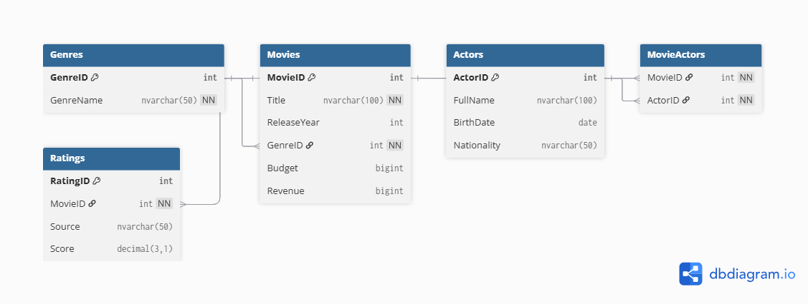

# 🎬 Movie Analytics Platform

A SQL-based data analysis project designed to simulate a real-world movie database. It includes relational table design, sample data, and analytical queries. Ideal for showcasing SQL skills in portfolio and GitHub.

---

## 📦 Project Structure

---

## 🧠 What You'll Learn

- SQL table creation with primary and foreign keys
- Data insertion and normalization
- Complex queries using `JOIN`, `GROUP BY`, `DISTINCT`, `ORDER BY`
- Real-world analysis: top genres, actor frequency, revenue trends
- Integration with Python (Pandas, Matplotlib) for deeper insights

---

## 🗂 Database Schema Overview

- `Movies`: title, release year, genre, budget, revenue
- `Actors`: name, birthdate, nationality
- `MovieActors`: many-to-many relationship between movies and actors
- `Genres`: genre list
- `Ratings`: IMDb, Rotten Tomatoes, user scores

---

## 🚀 How to Run

1. Open `CreateTables.sql` in SSMS and execute to create schema.
2. Run `InsertSampleData.sql` to populate tables.
3. Explore `AnalysisQueries.sql` for insights.
4. Optionally, use `movie_analysis.ipynb` in Python for visualization.

---

## 📸 Preview

Screenshots and ERD diagram are available in the `Screenshots/` and `SQL/` folders.

---

## 📚 License

This project is licensed under the MIT License.

---

## 📊 Database Design

Here’s the Entity-Relationship Diagram (ERD) for the Movie Analytics Platform:

---

## ✨ Author

Built by Sheeva — aspiring data analyst passionate about SQL, storytelling through data, and building real-world portfolio projects.
